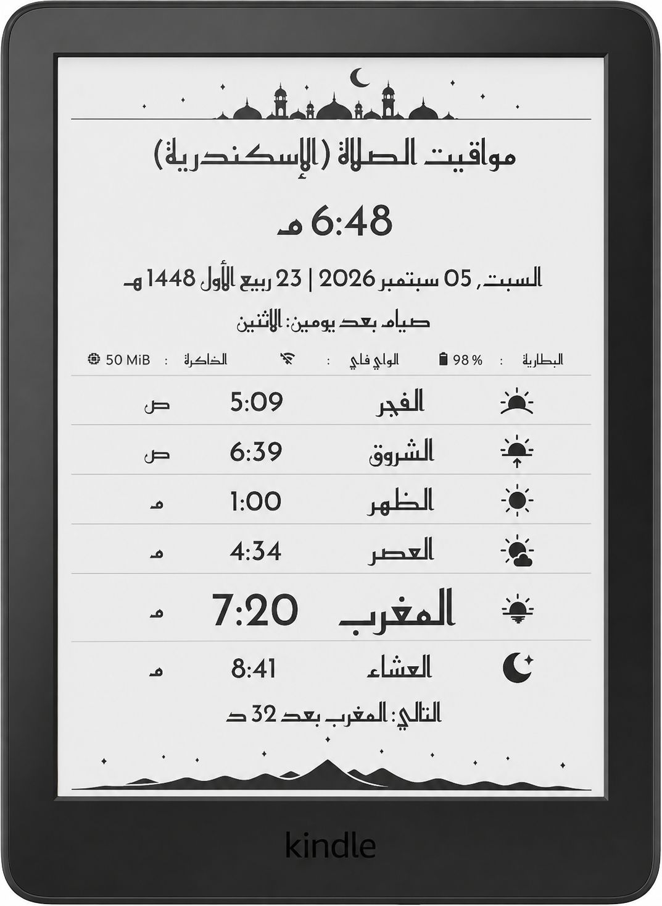
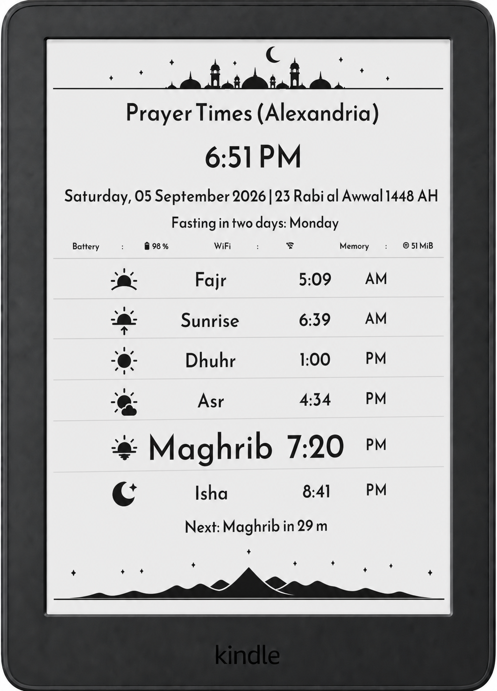

# Prayer Times for KOReader

**English** | [**العربية**](docs/README.ar.md)

**Repository:** [github.com/Mahmoudgomaa001/koreader.prayertimes](https://github.com/Mahmoudgomaa001/koreader.prayertimes)

A comprehensive Islamic prayer times plugin for KOReader, supporting multiple calculation methods, Hijri calendar, fasting reminders, custom fonts, and a bilingual Arabic/English interface.

## Features

- Accurate prayer time calculation (Fajr, Sunrise, Dhuhr, Asr, Maghrib, Isha)
- Seven calculation methods (MWL, Egyptian, Umm al-Qura, Karachi, ISNA, Jafari, Tehran)
- Hijri calendar with manual adjustment
- Fasting day reminders (Mondays/Thursdays, White Days, Ashura, Arafah, Six Shawwal)
- Customizable display (fonts, sizes, status widgets)
- Auto-show on device wake (battery‑friendly)
- Full Arabic and English UI with RTL support
- Location database with auto method suggestion
- Add custom locations
- Font management (user can add custom fonts)
- Alert options (flash, message, frontlight pulse)

> ℹ️ **Battery‑Friendly Design:**  
> This plugin does **not** keep your device awake in the background. It shows prayer times only when you open it, or optionally when the device wakes from sleep (if enabled). This approach helps preserve battery life on e‑ink devices like Kindle. The plugin is designed to be as power‑efficient as possible.

## Installation

1. Download the latest release ZIP from the [Releases page](../../releases).
2. Connect your e-reader (Kindle, Kobo, etc.) to your computer via USB.
3. Extract the ZIP file. You will get a folder named `prayertimes.koplugin`.
4. Copy that entire folder into the KOReader **plugins** directory:
   - **Kindle**: `koreader/plugins/`
   - **Kobo**: `.adds/koreader/plugins/`
   - **Android**: `koreader/plugins/`

   The final path should look like:  
   `koreader/plugins/prayertimes.koplugin/`

5. Safely eject the device.
6. Restart KOReader completely (exit and reopen, not just close the widget).

## Documentation

- [Full English Guide](docs/README.en.md)
- [الدليل الكامل بالعربية](docs/README.ar.md)

## Quick Start

1. Open KOReader.
2. Go to **Tools → Prayer Times**.
3. Select **Launch** to see today's prayer times.
4. To change location: **Set Location → Choose from list**.
5. To add your exact location easily, use the **"My Location"** button (or **"جد مكاني"** in Arabic) on [timesprayer.com](https://timesprayer.com/) to get your coordinates and calculation method automatically.

## Screenshots

| Arabic                           | English                           |
| -------------------------------- | --------------------------------- |
|  |  |

---

## License

MIT License – see [LICENSE](LICENSE) file.

## Contributing

Pull requests are welcome. Please test on your device before submitting.

## Updates & Issues

For the latest updates, bug reports, or feature requests, visit the [repository](https://github.com/Mahmoudgomaa001/koreader.prayertimes).
